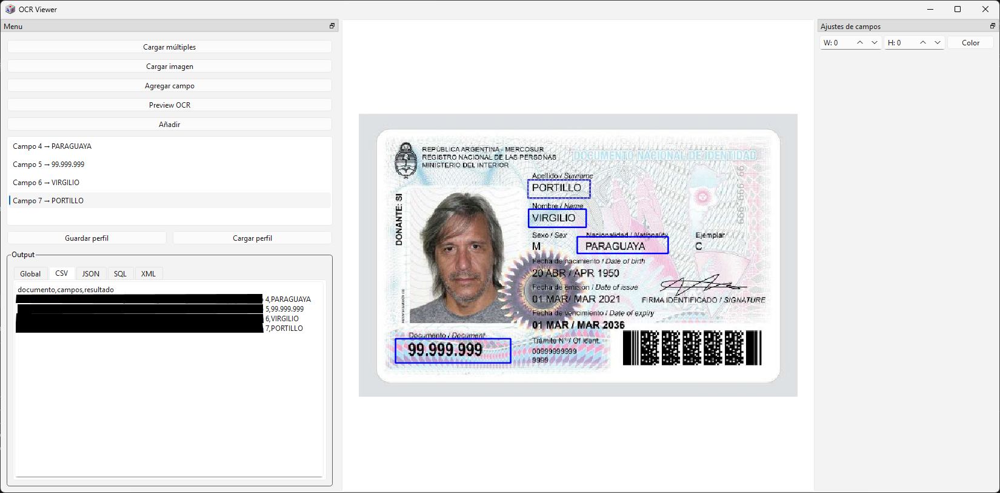

#  OCR Viewer — README
## Descripción general 

Este proyecto es una herramienta de procesamiento de formularios que combina:
- OCR (Tesseract) para leer texto dentro de áreas definidas

PyQt6 para una interfaz gráfica donde el usuario puede:
- cargar imágenes o multiples imágenes
- dibujar campos
- ejecutar OCR y obtener resultados estructurados
- El objetivo es permitir que cualquier usuario pueda digitalizar formularios de manera rápida, precisa y sin necesidad de entrenar modelos complejos.
## Captura de pantalla

## Características principales
- OCR por campos
- Permite seleccionar áreas rectangulares y extraer texto usando Tesseract.
- Interfaz gráfica intuitiva
- Dibujar campos con el mouse
- Previsualización del documento
- Exportación de resultados
- Procesamiento por página
## Tecnologías utilizadas
- Python 3.11	Lenguaje principal
- PyQt6	Interfaz gráfica
- Pillow (PIL)	Manipulación de imágenes
- Tesseract OCR	Reconocimiento de texto
## Instalación
1. Instalar dependencias

bash `pip install pyqt6 pillow opencv-python pytesseract pdf2image `

2. Instalar [Tesseract](https://github.com/UB-Mannheim/tesseract/wiki)

## Interfaz gráfica
La GUI permite:
1. Cargar imágenes (*.png *.jpg *.jpeg *.bmp )
2. Dibujar rectángulos sobre el documento
3. Seleccionar tipo de campo
4. Ejecutar OCR
5. Ver resultados en tiempo real
6. Incluye zoom, drag, y escalado suave para mejorar la experiencia.

## Exportación
- Los resultados se devuelven como un diccionario y pueden exportarse a CSV, JSON o copiarse al portapapeles.

python
`{
    "Nombre": "Juan Pérez",
    "DNI": "12345678",
}`

## Licencia
MIT — libre para uso personal y comercial.